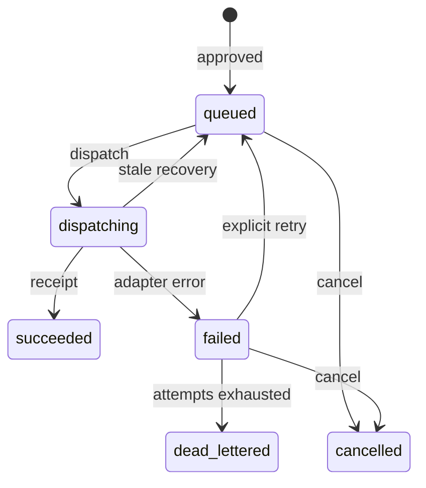

# Phase 6D4 — Approval-controlled Action Outbox

Phase 6D4 closes the durability gap between an approved agent proposal and an
execution attempt. Approval decisions remain the authority boundary; the
Action Outbox becomes the durable delivery boundary.

## Safety model

- Only an `approved` `AgentApproval` can create an outbox entry.
- Approval and automatic outbox enqueue commit in the same transaction.
- One approval maps to one outbox record and one stable idempotency key.
- Every record and event is automatically scoped to the authenticated user.
- Dispatch attempts are bounded and recorded before and after execution.
- Repeated dispatch of a succeeded action returns the existing receipt without
  incrementing its attempt count.
- Queued or failed actions can be cancelled. Succeeded, dispatching, cancelled,
  and dead-lettered actions cannot be cancelled again.
- Failed actions can be explicitly requeued while attempts remain.
- Dispatching records with stale claims can be recovered before batch work.

## Dry-run boundary

Version `0.6.7` supports only `execution_mode=dry_run`. Dispatch creates a
deterministic receipt, payload hash, attempt history, and final status, but it
does not send email, create a calendar event, submit an application, change a
financial plan, delete data, or call an external provider.

This is intentional. Provider adapters require credentials, provider-specific
validation, rate limits, reconciliation, and production environment approval.
The UI always displays the dry-run boundary so a simulated receipt cannot be
mistaken for real-world delivery.

## Lifecycle



## Canonical API

```text
GET  /api/v1/action-outbox/
GET  /api/v1/action-outbox/{outbox_id}
POST /api/v1/action-outbox/approvals/{approval_id}/enqueue
POST /api/v1/action-outbox/{outbox_id}/dispatch
POST /api/v1/action-outbox/{outbox_id}/retry
POST /api/v1/action-outbox/{outbox_id}/cancel
POST /api/v1/action-outbox/dispatch-ready
```

The approval enqueue endpoint is an idempotent recovery path for approved
records created before the automatic enqueue hook existed. Newly approved
actions do not require a separate enqueue request.

## Frontend

Open `/action-outbox` from the shared Command Center sidebar. The workspace
provides:

- search and status/action filters;
- visible queue, success, and attention metrics;
- exact approved payload inspection;
- dry-run dispatch for one or up to ten ready actions;
- explicit retry and cancellation controls;
- deterministic receipts, failure messages, and attempt counters;
- a chronological execution event history;
- loading, empty, success, and API error states.

## Database migration

Alembic revision `20260823_0008` creates:

- `agent_action_outbox`;
- `agent_action_outbox_events`;
- unique approval and idempotency constraints;
- user/status, run/time, ready-work, and event-history indexes;
- ownership and lifecycle constraints with cascade behavior.

## Verification

Backend:

```powershell
Set-Location backend
python -m pytest tests/test_phase6d4_action_outbox.py
python -m app.migrations.phase6d4_smoke_test
python -m app.migrations.phase6d4_runtime_verify --base-url http://127.0.0.1:8000
```

Frontend:

```powershell
Set-Location frontend
npm run verify:phase6d4
npm run typecheck
npm run lint
npm run build
```

The integration suite covers automatic enqueue, edited approval payloads,
cross-user isolation, idempotent success, simulated adapter failure, explicit
retry, cancellation, rejected-action exclusion, bounded batch dispatch, owner
stamping, event history, routes, version, and migration head.
